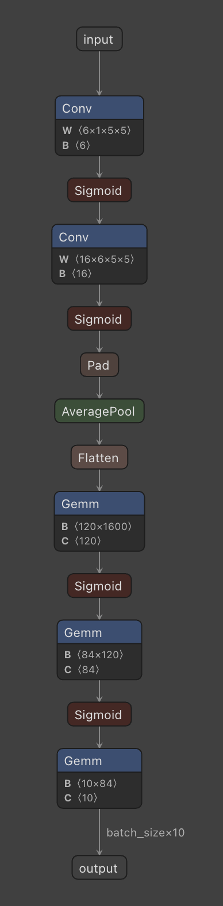

# easy_pytorch

easy_pytorch是一个pytorch训练框架，方便kaggle竞赛，临时项目以及科研等工作。

代码现已为pytorch2.0进行优化。

## 使用说明

1 将模型代码放入model文件夹
2 将数据加载代码放入feeder文件夹
3 配置优化器
4 设置损失函数
5 设置评分函数
6 设置数据保存方式
7 配置文件放入config文件夹

```bash
pip install -e torchlight
```

## 运行项目

本项目提供了一个使用LeNet对FashionMnist进行分类的示例，运行代码

```bash
python main.py --config config/config.yaml --device 0
```

## 启动tensorboard

```bash
tensorboard --logdir=work_dir/mnist/runs --bind_all
```

## 训练和测试

test:

```bash
python main.py --config config/config.yaml --phase test --save-score True --device 0 --weights ?
```

train:

```bash
python main.py --config ? --device 
```

## version 2.0： Update for pytorch 2.0

我们非常高兴能够见证pytorch 2.0的诞生，同时，我们在第一时间对我们的模版进行了更新，以满足对pytorch 2.0的支持。

### compile

新版本为pytorch 2.0 的compile功能进行了优化。我们增加了compile参数，以选择是否开启compile，如果开启，则开启编译功能,默认为false。

torch.compile具有mode参数，参数拥有以下三种，默认为False：

- default：默认优化
- reduce-overhead: 减少模型开销但提升内存占用，可以帮助小模型提速
- max-autotune: 最大化提升模型速度

### AMP

我们为自动混合精度提供了支持，设置参数AMP为True可以开启自动混合精度，默认为False。

同时我们配置了参数Scaler，设置为True可以放大损失值来防止梯度的下溢，默认为False

### 其他的更新

我们还对很多潜在的bug进行了修复，有些在1.x系列更新中已经更新完毕。

### 正在做的事

随着功能的增加，README.md目前显得非常冗长，我们将在之后的工作中将README.md作为基础入门和更新日志，并撰写完整的使用说明书。

## version 2.1: 模型部署

首先，我们的项目正式更名为：easy_pytorch。在版本2.1中，我们进行了对模型部署的探索，并提供了一个模型部署的代码，用于导出onnx格式文件。

### 模型部署实验

模型的推理和部署是深度学习落地的重要环节，我们在2.1版本中增加对onnx导出的支持，以及进一步研究推理优化。

执行推理框架请安装下列依赖：

```bash
pip install onnx 
# 安装onnx runtime
pip install onnxruntime
```

请根据注释调整推理代码，并运行：

```bash
python interface.py
```

onnx文件可以在[netron](https://github.com/lutzroeder/netron)上形成模型结构图。




